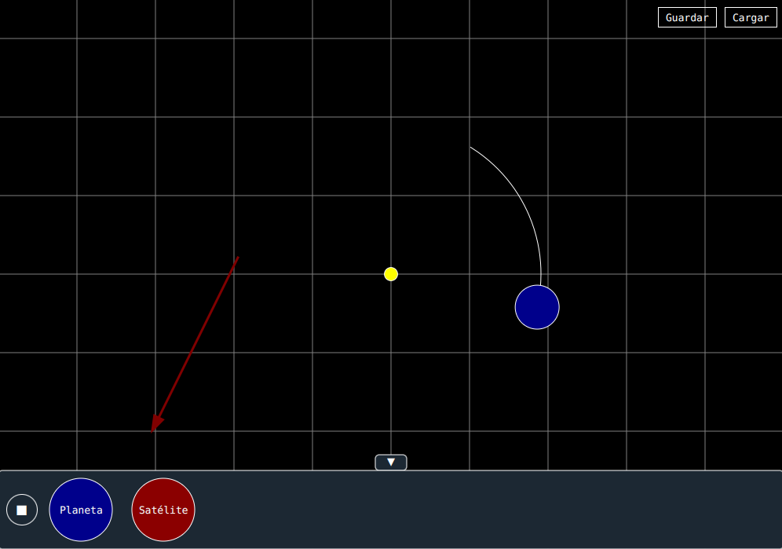
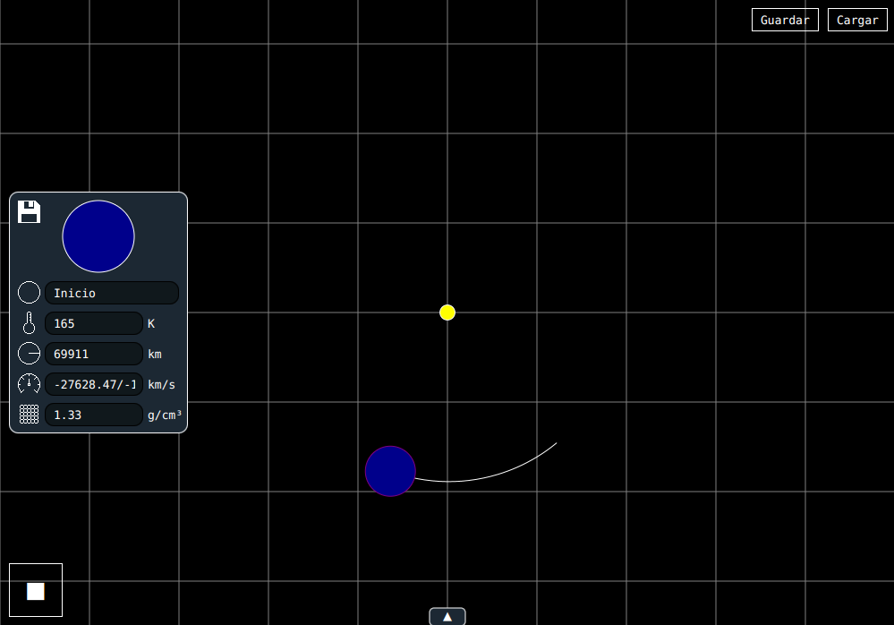
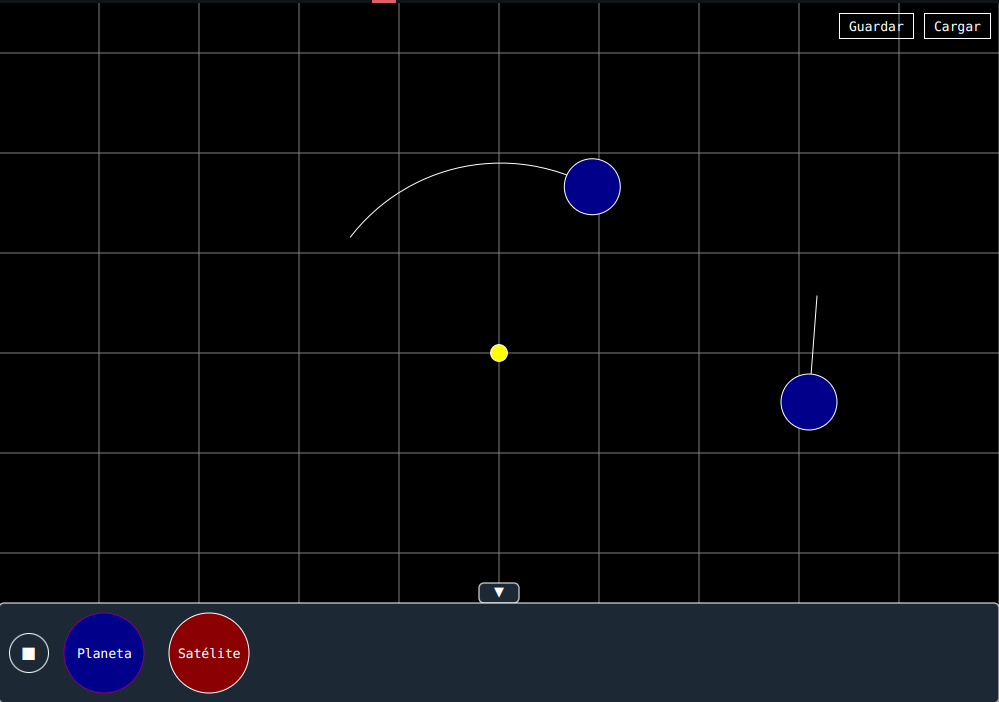
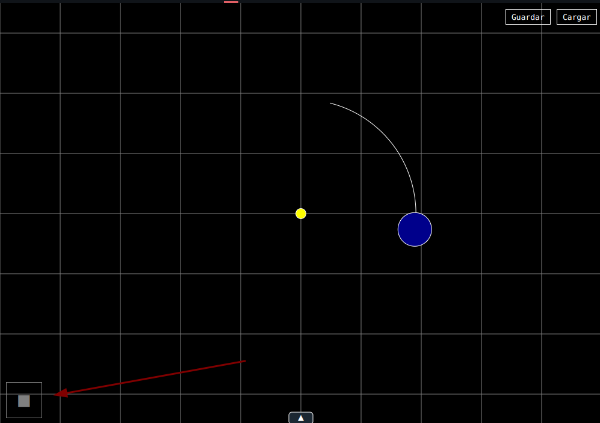
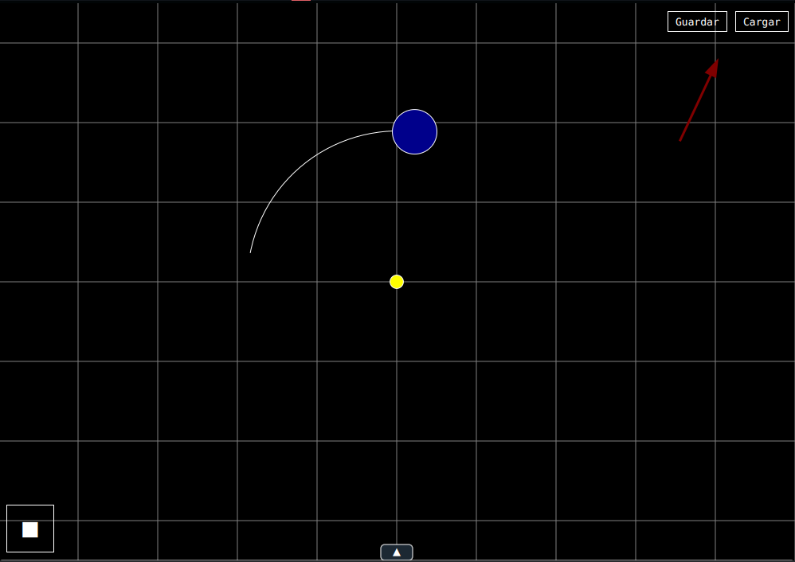
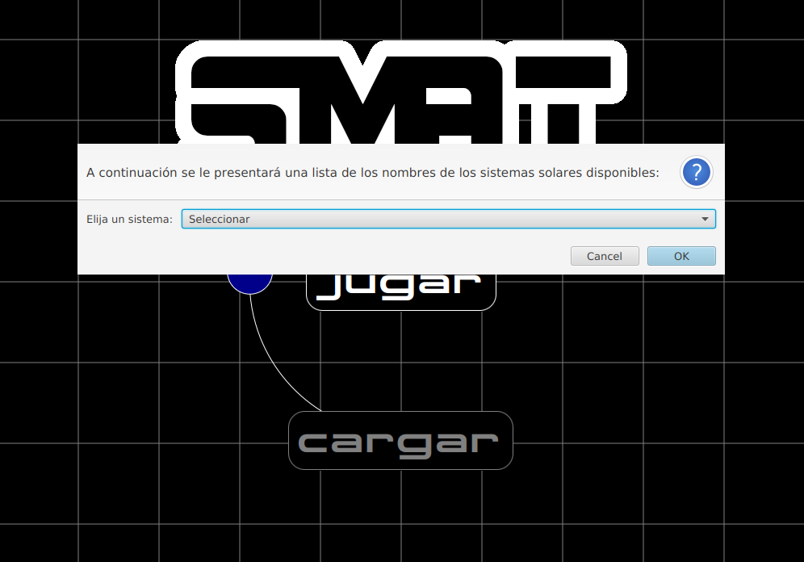

# SMAT (Stellar Mission Analysis Tool)

El link del proyecto se puede encontrar en https://github.com/0laqase93/SMAT

## Descripción
**SMAT** (Stellar Mission Analysis Tool) es una aplicación de **simulación 
de órbitas espaciales** para la clase de DAM hecha en **Java y javaFx** que 
permite a los usuarios explorar y visualizar el movimiento de cuerpos 
celestes en el espacio. Utilizando las leyes de la física (Newton). La 
aplicación simula el movimiento de planetas, satélites y otros objetos celestes 
**alrededor de una estrella central**.

## Características
### 1. Creación de Sistemas Estelares
- Se puede **crear sistemas** estelares con una estrella 
  central y múltiples planetas y/o satélites.
  

- **Modificar las características** de cada cuerpo celeste, como su densidad, 
  radio, temperatura, nombre y velocidad.
  

### 2. Simulación de Órbitas
- **Realizar orbitas** con el lanzamiento del planeta.
  

### 3. Visualización Interactiva
- Función de poder **pausar y reanudar** la animación de los cuerpos.
  

### 4. Personalización Avanzada
- Permitir a los usuarios **guardar y cargar configuraciones** de sistemas estelares 
  para su posterior uso o modificación con el nombre del sistema solar como referencia.
  

### 6. Exploración del Espacio Exterior
- Se asignarán sistemas **solares de prueba** para que el usuario pueda cargarlos y ver algunos 
  modelos que se pueden.
  

### 7. Colisiones
- Se ha creado una simulación muy básica sobre la colisión entre dos cuerpos celestes.
- Cuando colisionan expulsan fragmentos con sus físicas y polvo que no tiene ningún tipo de relevancia en la simulación.

## Curiosidad
El nombre SMAT hace referencia al programa que usa la NASA para 
simular órbitas y realizar cálculos orbitales es el "General Mission 
Analysis Tool" (GMAT)[[1](#referencias)].

## REFERENCIAS
[1] [Link de información de GMAT](https://software.nasa.gov/software/GSC-17177-1)